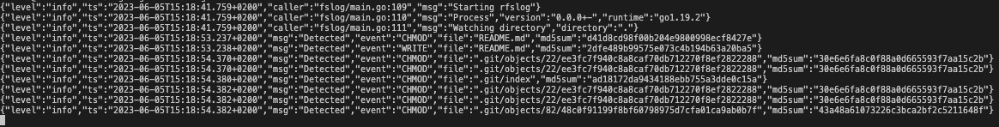

# File Change Log

Records file changes in a specific directory.

## Getting Started

```shell
rfslog --watch .
```



### 🛠 Build from Source

All required dependencies for compilation are already packaged as part of the Go project. It is recommended to use a modern version of the Go toolchain and no longer store the code repository in the old GOPATH.

<details>
  <summary>🧰 Go Installation Reference</summary>
  
### Windows
1. Install a package manager.
    ```powershell
    Set-ExecutionPolicy RemoteSigned -scope CurrentUser
    Invoke-Expression (New-Object System.Net.WebClient).DownloadString('https://get.scoop.sh')
    ```

2. Install ***golang*** & ***make***。
    ```powershell
    scoop install go make
    ```

### CentOS7
1. Install ***epel-release***。
    ```shell
    yum install -y epel-release && yum update -y
    ```

2. Install ***golang*** & ***make***。
    ```shell
    yum install -y golang make
    ```

### Mac

- Mac ports
    ```shell
    sudo ports install golang make
    ```

- Brew
    ```shell
    sudo brew install golang make
    ```

</details>

1. Download the source code.

   ```shell
   git clone "https://github.com/deflinhec/rfslog" rfslog
   cd rfslog
   ```

2. Build from source.

   ```shell
   go build -trimpath -mod=vendor
   ```

### 🛠 Cross-Platform Build

The build process uses the [GNU make toolchain](https://www.gnu.org/software/make/manual/make.html) to ensure consistent build processes across different platforms.

1. Build for diffirent platform.

    ```shell
    make cross-compile-linux-amd64
    make cross-compile-linux-arm64
    make cross-compile-darwin-arm64
    make cross-compile-darwin-amd64
    make cross-compile-windows-amd64
    ```

## 📜 Command-Line Options

| Option                        | Description                                                                               |
| ----------------------------- | ----------------------------------------------------------------------------------------- |
| --version                     | Display versio information.                                                               |
| configfile                    | Export a template configuration file in the working directory.                            |


| Option                         | Description                                                                 | Default value|
| ------------------------------ | --------------------------------------------------------------------------- | ------------ |
| --config                       | Absolute path to the configuration YAML file.                               |              |
| --watch                        | Directory to monitor the file changes.                                      | .            |
